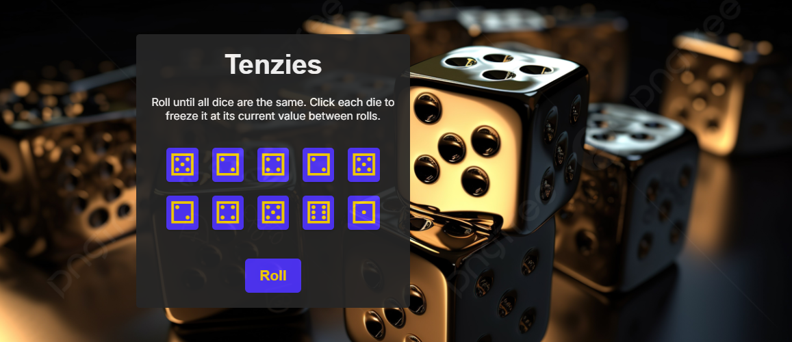

# 🎲Tenzies-A-Mini-Game
## 🚀 Demo: [https://sifatahammed.github.io/Tenzies/](https://sifatahammed.github.io/Tenzies/)

A fun and interactive React-based implementation of the classic dice game **Tenzies**. Roll the dice until all values are the same. Click each die to hold its value between rolls!



## 🧩 Features

- 🎯 Roll until all dice match
- ✋ Click to "hold" dice and prevent them from changing
- 🎉 Confetti animation on win
- ♿️ Accessible buttons with ARIA labels
- 🔄 "New Game" button appears when you win

---

## 🛠️ Technologies Used

- React
- Vite
- nanoid (for unique die IDs)
- CSS Flexbox & Grid
- [React-Confetti](https://www.npmjs.com/package/react-confetti)

---

## 🧠 How to Play

1. Click the **Roll** button to roll all dice.
2. Click on dice to **hold** their values.
3. Keep rolling until **all dice show the same number**.
4. Enjoy the celebration and click **New Game** to play again!

---

## 📦 Installation

```bash
git clone https://github.com/sifatahammed/Tenzies-A-Mini-Game
cd Tenzies-A-Mini-Game
npm install
npm run dev
```
## 🗂️ Project Structure
```plaintext

tenzies-game/
├── app-components/
│   └── App.jsx
├── components/
│   └── Main.jsx
├── images/
├── index.html
├── index.css
├── index.jsx
├── package.json
└── package-lock.json
```
## 🧑‍💻 Author
Made with ❤️ by MD SIfat Ahammed Akash

## 📄 License
This project is licensed under the MIT License.


